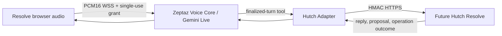

# Voice adapter architecture

`core/` contains reusable audio, language and validated configuration pieces. `adapters/hutch/` owns Hutch request/response models, binding grant storage, turn forwarding, Resolve client and safe error mapping. The core does not own Hutch billing/VAS/ticket rules. Resolve remains authoritative for customer scope, evidence, proposals, confirmation and execution.

This implementation uses one Voice process, SQLite for short lived integration bindings/grants/event cache, and the existing Gemini Live SDK. It does not add Redis or a service fleet. SQLite and in-process live sessions assume one Voice worker for the hackathon. A multi-worker production deployment needs a shared grant/session store.

The inspected source has a larger order/appointment tool executor and demo support. The copy here reuses the codec, live configuration and English/Sinhala/Tamil language policy in isolation. Restaurant templates, order database, dashboard, demo catalogues, `.env` files, cost reports, caches and deployment artifacts are excluded. The Hutch session API, adapter and Resolve callback are new.
